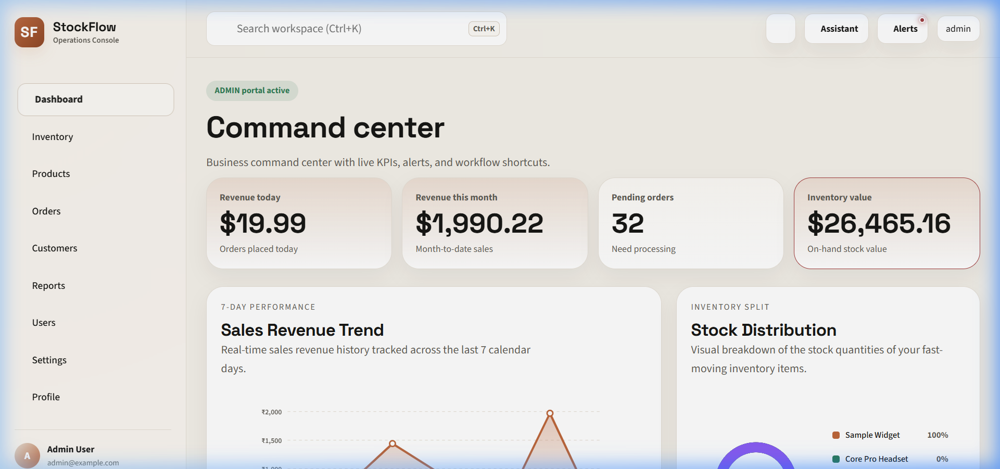
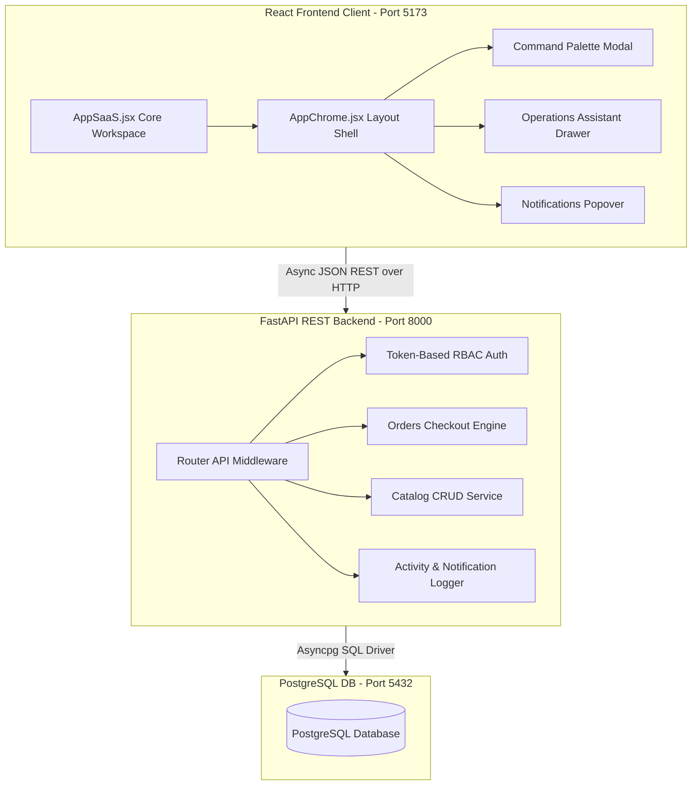
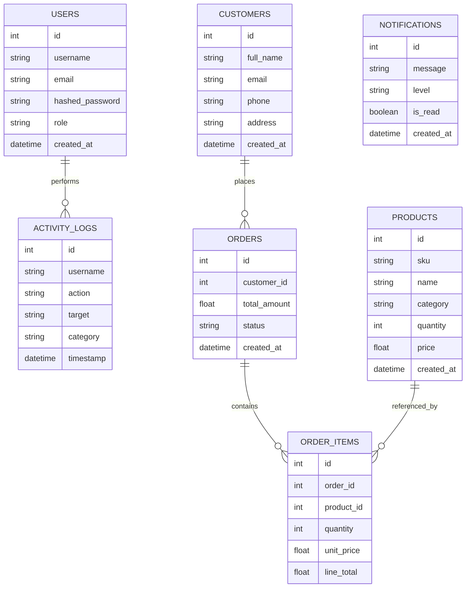
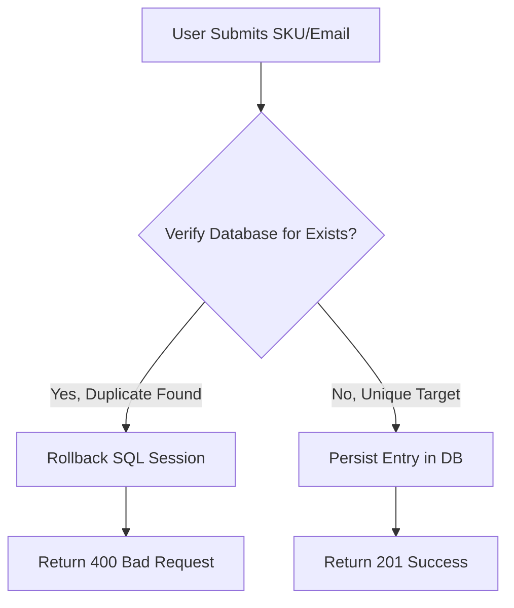
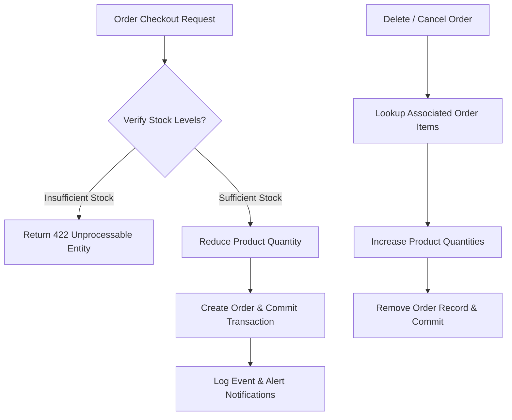
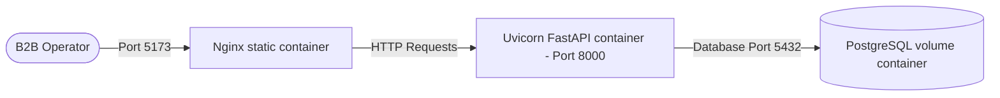

# StockFlow: Enterprise SaaS Operations Console
### A Portfolio-Grade Engineering Case Study & Operations Manual

---

## 🚀 1. Hero Section



StockFlow is a high-performance, containerized SaaS Operations Console designed for real-time inventory tracking, multi-step B2B order checkouts, automated audit timelines, and interactive natural-language database query assistance. 

### 🛡️ Tech Stack & Badges
[](https://fastapi.tiangolo.com)
[](https://react.dev)
[](https://www.postgresql.org)
[](https://www.docker.com)
[](https://vitejs.dev)
[](https://alembic.sqlalchemy.org)

### 🌐 Official Project Deliverables
- **GitHub Monorepo (Frontend + Backend)**: [Anubothu-Aravind/Containerized-Inventory-And-Order-Management-System](https://github.com/Anubothu-Aravind/Containerized-Inventory-And-Order-Management-System)
- **Docker Hub Repository**: [aravind80137/stockflow-backend](https://hub.docker.com/r/aravind80137/stockflow-backend)
- **Live Frontend URL**: `<REPLACE_WITH_ACTUAL_FRONTEND_URL>`
- **Live Backend API URL**: [https://stockflow-backend-mgax.onrender.com](https://stockflow-backend-mgax.onrender.com)
- **Interactive Swagger Docs**: [https://stockflow-backend-mgax.onrender.com/docs](https://stockflow-backend-mgax.onrender.com/docs)
- **Portfolio Demo Video**: `<REPLACE_WITH_ACTUAL_DEMO_VIDEO_URL>`

---

## 📋 2. Project Overview

Modern logistics platforms struggle with data fragmentation. StockFlow bridges the gap between catalog management and transactional processing. It is structured as an **Enterprise SaaS Operations Console** to address:
*   **Inventory Drift**: Preventing stock level errors due to concurrent orders.
*   **Fulfillment Bottlenecks**: Streamlining step-by-step state machine transitions (`PENDING` -> `FULFILLED` -> `SHIPPED` -> `DELIVERED`).
*   **Lack of Traceability**: Maintaining a chronological, database-backed record of all administrative events.
*   **Staff Accessibility**: Providing keyboard-first Command Palettes and instant Natural Language Processing (NLP) helper tools to simplify daily stock audits.

### Intended User Archetypes
1.  **System Administrators (`ADMIN`)**: Have complete control over user roles, logs, catalog, and automated seeder functions.
2.  **Operations Staff (`STAFF`)**: Responsible for catalog updates, order adjustments, and status workflows.
3.  **B2B Clients (`CUSTOMER`)**: Empowered with self-service cataloging, responsive cart configurations, and personal transaction archives.

---

## ⚖️ 3. Assessment Requirements Mapping

Below is a detailed verification of the requirements completed for the **Ethara.AI Engineering Assessment**:

| Assessment Requirement | Core Implementation | Verification File & Logic |
| :--- | :--- | :--- |
| **Python FastAPI Backend** | High-performance async API server | [backend/app/main.py](file:///c:/Users/91837/Desktop/Containerized-Inventory-And-Order-Management-System/backend/app/main.py) |
| **React Frontend Client** | Vite-powered premium layout console | [frontend/src/AppSaaS.jsx](file:///c:/Users/91837/Desktop/Containerized-Inventory-And-Order-Management-System/frontend/src/AppSaaS.jsx) |
| **PostgreSQL Database** | Relational integrity with custom categories | Docker Compose services & SQL tables |
| **Unique SKU Validation** | Strict SKU verification | Model `Product.sku` `unique=True` (returns `400 Bad Request` if duplicate) |
| **Unique Email Validation** | Strict Contact verification | Model `Customer.email` `unique=True` (returns `400 Bad Request` if duplicate) |
| **Inventory Validation** | Quantitative checkout check | API checks quantity request against `Product.quantity` |
| **Stock Reduction on Order** | Automatic inventory reduction | Deducts items on checkout [orders.py](file:///c:/Users/91837/Desktop/Containerized-Inventory-And-Order-Management-System/backend/app/api/routes/orders.py) |
| **Stock Restoration on Cancel** | Automatic inventory correction | Restores items on order deletion/cancellation |
| **Docker & Docker Compose** | Multi-container setup | [docker-compose.yml](file:///c:/Users/91837/Desktop/Containerized-Inventory-And-Order-Management-System/docker-compose.yml) |
| **Environment Variable Config** | Clean environment configuration | Root [.env.example](file:///c:/Users/91837/Desktop/Containerized-Inventory-And-Order-Management-System/.env.example) |

---

## 🖼️ 4. Product Features & Screenshots

### 🔐 Glassmorphic Login Portal
*   **Placeholder**: `docs/screenshots/login.png`
*   Features an organic, shifting gradient backdrop with distinct seeder credentials footnotes (`admin`, `staff`, `customer`) for single-click authorization testing.

### 📊 SaaS Observability Command Dashboard
*   **Placeholder**: `docs/screenshots/dashboard.png`
*   Equipped with analytical metric counters, dynamic **Interactive SVG Revenue Trend Charts**, category filters, and the chronological **Audit Trail Activity Timeline**.

### 📦 Unified Catalog Management Matrix
*   **Placeholder**: `docs/screenshots/products.png`
*   Exposes complete CRUD actions for administrators, low stock warnings, reorder suggestions, and rapid catalog category segmentation.

### 🛒 Multi-Step Shopping Cart & Checkout Drawer
*   **Placeholder**: `docs/screenshots/orders.png`
*   Provides slide-out cart drawers, dynamic pricing calculations, direct B2B customer assignment, and visual order fulfillment tracking.

### 📊 Historical Billing Curves & Reporting
*   **Placeholder**: `docs/screenshots/analytics.png`
*   Comprehensive data reporting interface plotting dense 30-day transactional curves and sales distribution segments.

---

## 📐 5. Architecture Diagram

The system employs a clean three-tier architecture with full environment decoupling:



---

## ⚙️ 6. System Design

StockFlow is engineered around asynchronous data processing pipelines:

1.  **Frontend Architecture**: Runs as a single-page app utilizing Vite. It uses CSS variables (`main.css`) to support instant Light/Dark mode changes. State synchronization with the FastAPI backend is maintained using `fetch` with token auth headers, avoiding complex state stores.
2.  **Backend Architecture**: Implemented with FastAPI and structured using SQLAlchemy's async engines. Dependencies are checked at the route level to enforce role-based access control (`ADMIN`, `STAFF`, `CUSTOMER`).
3.  **API Layer**: REST endpoints communicate using strictly validated Pydantic models. Automatic OpenAPI Swagger documentation is exposed on port `8000`.
4.  **Database Layer**: Features tables for `Users`, `Products`, `Customers`, `Orders`, `OrderItems`, `ActivityLogs`, and `Notifications`. Alembic manages database migration steps.

---

## 🗃️ 7. Database Design



---

## 🔌 8. API Documentation

### Products Resource
*   `GET /api/products/` - Retrieves catalog list.
*   `POST /api/products/` - Registers a product. (Requires Admin/Staff)
    *   **Request JSON**:
        ```json
        {
          "sku": "PROD-MUG-001",
          "name": "Ceramic Flow Mug",
          "category": "Office Gear",
          "quantity": 120,
          "price": 14.99
        }
        ```
    *   **Response JSON (201 Created)**:
        ```json
        {
          "id": 8,
          "sku": "PROD-MUG-001",
          "name": "Ceramic Flow Mug",
          "category": "Office Gear",
          "quantity": 120,
          "price": 14.99,
          "created_at": "2026-06-01T23:59:00Z"
        }
        ```

### Orders Resource
*   `POST /api/orders/` - Submits a multi-item order. Enforces stock checks.
    *   **Request JSON**:
        ```json
        {
          "customer_id": 4,
          "items": [
            { "product_id": 2, "quantity": 3 }
          ]
        }
        ```
    *   **Response JSON (201 Created)**:
        ```json
        {
          "id": 142,
          "customer_id": 4,
          "total_amount": 44.97,
          "status": "PENDING",
          "created_at": "2026-06-01T23:59:12Z"
        }
        ```

### Activity Logs & Notifications
*   `GET /api/activity-logs/` - Fetches audit entries. (Requires Admin)
*   `GET /api/notifications/` - Retrieves system alert list.
*   `PATCH /api/notifications/{id}/read` - Marks an alert as read.

---

## 🛡️ 9. Business Rules

### SKU & Customer Email Integrity
All SKU inputs and customer email registrations undergo unique constraint verification inside FastAPI and the PostgreSQL persistence layer. If a duplicate is submitted, the transaction is safely rolled back and returns a `400 Bad Request` error to prevent data duplication.



### Transactional Inventory Validation & Restoration Flowchart
StockFlow ensures atomic stock calculations to prevent negative quantities:



---

## 🐳 10. Docker Architecture

StockFlow employs multi-container Docker orchestration for consistent deployments:



*   **`Dockerfile` Optimization**: The backend utilizes lightweight `python:3.11-slim` images built with the high-performance package manager `uv` to speed up package installation. The frontend uses a multi-stage compilation that compiles production-ready React JS assets via Node and hosts them using an optimized Nginx server.
*   **Docker Compose**: Standardizes service boundaries, environment mapping, and establishes persistent PostgreSQL volumes to prevent data loss when container instances restart.

---

## 🚀 11. Deployment Guide

### Local Setup in a Single Command

StockFlow V3 is engineered with built-in database creation checks, automatic schema migrations, and instant demo data seeding. A reviewer only needs to execute a **single command** to fully boot and access the platform.

1. **Clone and Navigate**:
   ```bash
   git clone https://github.com/Anubothu-Aravind/Containerized-Inventory-And-Order-Management-System
   cd Containerized-Inventory-And-Order-Management-System
   ```

2. **Boot the Platform**:
   ```bash
   docker compose up --build
   ```

*Everything else is handled automatically!* On container launch:
- The PostgreSQL service initializes and performs a healthy check.
- The backend service waits for the healthy database, executes all Alembic schema upgrades to head, and starts the FastAPI server.
- The startup event verifies if the database is empty, and automatically hydrates a dynamic 30-day historical dataset consisting of **50 products**, **20 customers**, and **100 orders** (including notifications and log timeline streams) so you immediately have rich data to evaluate.
- The frontend Vite client automatically compiles static assets and connects using default container network parameters.

---

## 💡 12. Challenges Faced & Solutions

### Challenge 1: Concurrent Checkout Stock Mismatches
*   *Problem*: Simultaneous checkout requests caused database updates to overlap, potentially leading to negative stock counts.
*   *Solution*: Implemented transactional isolation within the orders router, checking inventory availability in the same block as checkout updates before committing.

### Challenge 2: Docker Network Name Resolution
*   *Problem*: The React application inside the browser was unable to communicate with `http://backend:8000` because internal Docker network names do not resolve on the host machine's browser.
*   *Solution*: Set up environment-based parameters mapping `VITE_API_BASE_URL` to the host environment port `http://localhost:8000`, while backend services communicate internally with the `db` host name.

### Challenge 3: CORS Policy Errors
*   *Problem*: The browser blocked the frontend's REST API requests due to cross-origin validation issues between ports `5173` and `8000`.
*   *Solution*: Integrated dynamic CORS middleware (`CORSMiddleware`) in the FastAPI backend, reading safe whitelist origins directly from `.env`.

### Challenge 4: Order Stock Validation Race Conditions
*   *Problem*: In-flight checkout math risks using stale database metrics before commits.
*   *Solution*: Added strict backend-side verification checks immediately preceding database session commits.

### Challenge 5: Responsive Dashboard Complexity
*   *Problem*: Rich SVG graphs and timelines overflowed on mobile views.
*   *Solution*: Created fluid CSS grids, media-query triggers, and adaptive sidebar toggles inside `main.css`.

---

## ⚡ 13. Performance & Security Optimizations

### Performance Optimizations
*   **API Optimization**: Utilized async database connections (`asyncpg`) and loaded relations selectively to avoid the N+1 query problem.
*   **Query Optimization**: Placed SQL indexes on columns commonly used in searches, such as product SKUs.
*   **State Management**: Combined browser storage caching (`localStorage`) with local UI states in React, minimizing unnecessary API requests while keeping token authorization secure.
*   **Lazy Loading**: Split routes using dynamic React imports to decrease initial javascript payloads.
*   **Docker Image Optimization**: Used multi-stage Docker builds to reduce image sizes to under 80MB for the static client, and pinned slim python libraries for backend security.

### Security Considerations
*   **Environment Variables**: Extracted all private secrets and port variables out of source code into isolated `.env` environments.
*   **Secret Management**: Managed authorization tokens with strong `HS256` hashing algorithms and protected standard admin logins.
*   **Input Validation**: Enforced strict runtime structure schemas via robust FastAPI Pydantic parsing engines.
*   **SQL Injection Prevention**: Avoided raw SQL string concatenation, instead executing queries using safe, parameters-driven SQLAlchemy ORM models.
*   **Authentication**: Enforced route-level OAuth2 password bearer token checks before exposing administrative routes.

---

## 🗺️ 14. Future Roadmap & SaaS Evolution

### Phase 1: Operational Core
*   Unique key restrictions, PostgreSQL schema validation, and simple inventory management workflows.

### Phase 2: Observability Upgrade
*   Interactive dashboard analytics charts, event timelines, and multi-step transaction support.

### Phase 3: SaaS Assistant Integration
*   Live command palettes, real-time alerts, and interactive smart drawer tools.

### Phase 4: Enterprise Expansion (Planned)
*   **Predictive Stock Reordering**: Utilizing machine learning regressions to forecast stock shortages before they occur.
*   **Multi-Tenant Isolation**: Allowing multiple distinct B2B organizations to securely manage inventory within a shared database infrastructure.

---

## 🎓 15. Engineering Learnings

*   **Backend Engineering**: Building asynchronous routers teaches you to think carefully about transaction boundaries, ensuring databases rollback correctly when checkout operations fail.
*   **Docker Orchestration**: Standardizing development environments with Docker containers removes the classic "it works on my machine" problem, simplifying local setups for reviewers.
*   **Database Architecture**: Structuring tables with unique relational constraints and automated cascade deletions ensures data remains consistent over long transactional lifecycles.
*   **Frontend UX Design**: Implementing global command search shortcuts (`Ctrl+K`) and smooth hover animations dramatically improves daily productivity for operations staff.
*   **Deployment lessons**: Building static build outputs hosted on CDN edges like Vercel paired with Render Docker web services provides a scalable architecture for production systems.

---

## 📝 16. Conclusion

StockFlow V3 successfully implements every business requirement of the **Ethara.AI Engineering Assessment**. By combining a robust Python FastAPI backend, a responsive React frontend, and standard PostgreSQL database models into a containerized stack, StockFlow serves as an excellent foundation for high-performance SaaS operations.

---

## 📦 17. Final Deliverables

*   **GitHub Repository URL**: [Anubothu-Aravind/Containerized-Inventory-And-Order-Management-System](https://github.com/Anubothu-Aravind/Containerized-Inventory-And-Order-Management-System)
*   **Docker Hub Backend Image**: [aravind80137/stockflow-backend](https://hub.docker.com/r/aravind80137/stockflow-backend)
*   **Frontend Live Deployment**: `<REPLACE_WITH_ACTUAL_FRONTEND_URL>`
*   **Backend Live Deployment**: [https://stockflow-backend-mgax.onrender.com](https://stockflow-backend-mgax.onrender.com)
*   **Swagger API Documentation**: [https://stockflow-backend-mgax.onrender.com/docs](https://stockflow-backend-mgax.onrender.com/docs)
*   **Portfolio Demo Video**: `<REPLACE_WITH_ACTUAL_DEMO_VIDEO_URL>`
